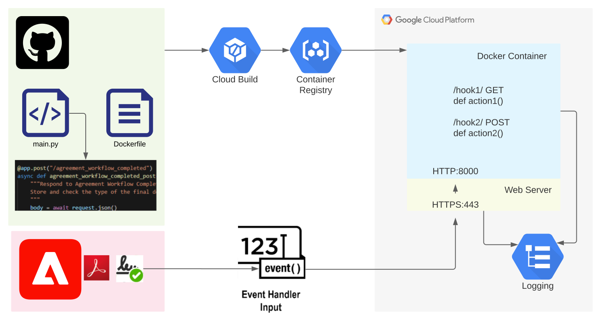

# Demo - Creating Webhooks for Adobe Sign agreement events

This lightweight example demonstrates how, with 
just a few lines of code, webhooks endpoints can be hosted on a cloud service, to 
handle Adobe Sign Webhook events.  

Depending on experience and what tools are already installed, a developer should 
be able to get a demo instance running fairly quickly. 

# Overview

The repo contains several endpoint definitions in main.py, and dependencies 
in requiremements.txt.

Because we are using Google's Cloud SDK, there is no need to build code locally, as long as we simply
want to run the service in the cloud. Instructions below show how to send 
the repo to Google's 
build system, where the Dockerfile will control Docker image creation.  A 
fresh image will be stored in the container registry, ready to deploy.

Another CLI command helps deploy the image to a Google Cloud Run instance, 
behind Cloud Run's web server 
proxying HTTPS requests, where it should be able to scale to any reasonable traffic volume. 

Sign events forwarded as Webhook requests to the HTTPS port of the Google Cloud Run 
instance are mapped by URL to the event handlers in main.py.

One handler responds to all agreement events, and the other only to Document Complete 
events. Currently there is no real action taken, beyond logging. The single exception is that 
if document complete Webhooks are specified (checkbox) to also include the final document, 
that document is fetched from the request, and stored as a file. This could be the starting 
point for a webhook that stashes documents in a client's Dropbox account, for example, but 
nothing special is done with that file yet, in this outline handler.

# Helpful skills

  ## To install
  
  -  git 
  -  Visual Studio Code, PyCharm, IntelliJ
  -  Google Cloud Platform (GCP)
  -  Google Cloud SDK

  ## To extend this to a real application
  
  - a bit of python knowledge
  - some familiarity with the Adobe Sign Webhook API, and the Sign dashboard

# Installing 

Starting with GCP is a only a small step beyond having a gmail account. 
There is a $300/90day free credit for beginners, so funding a developer account
is not an issue at the start.

This outline can also be extended for Azure Container Instances. The core code and 
principles remains the same.

# Set up 

There are several sections. I've tried to make the steps as light as possible. This is
Windows-oriented. Mac steps will be similar.

## Get the code

Get this repo, using VPN access

    git clone git@git.corp.adobe.com:rferriday/sign-webhook-demo.git

## Google Cloud Run
### Get the SDK

Install Google's SDK. Look here: https://cloud.google.com/sdk/docs/install. 
Start by creating a testing gmail account, or using an existing one, 
and log in with your default browser.
At the end of the SDK install, a browser will open. Accept defaults, and
 agree to the oauth requests for Google Cloud SDK. 
 You should be brought back to the shell, and be invited to create a first 
 project. Don't do that, yet.

You will need to accept terms of service at this URL, before setting up a project: 
https://console.cloud.google.com/  
Click the usual checkboxes and CTA...
Leave the browser open -- you'll need it again soon

### Create a project to contain all assets

I'll create a project via CLI. You could also do some/all of this setup on the GCloud web console.

Using the Windows start menu, find "Google Cloud SDK Shell" and run it. In that shell

    gcloud projects create sign-webhooks-rf-210714 --name="Sign Webhook Demo"
    gcloud config list
    gcloud config set run/region europe-west2

Now nip back to the console in the browser, and see if you can select the project you just made above. 
You will *probably* see a banner asking you to try the $300/90 day trial... Go for it...

### Build the deployable image

Go back to the Cloud SDK Shell and navigate using *cd* to the home of this
project (where this README.md is found)

Note: When you first issue the next command, you'll be asked to enable and retry after adding the cloudbuild API. Just accept, 
and then you'll probably hit an access error:
  "\<service account> does not have storage.objects.get access to the Google Cloud Storage object."
To fix this, go to your console, IAM & Admin (here, https://console.cloud.google.com/iam-admin) and 
you'll see a couple of Members. The one allocated the Cloud Build Service Accounts role also needs the 
Cloud Build Viewer role. So... Click the Edit pencil, + ADD ANOTHER ROLE, Cloud Build Viewer, Save. 
Then check that the new role has been allocated to the member, and try again.

The command:

    gcloud builds submit --tag gcr.io/sign-webhooks-rf-210714/first-demo

### Deploy
Again, for the first run you will be invited to accept the run.googleapis.com API. 
When asked, also accept unauthenticated invocation - which allows any Https client to access the API. 

    gcloud run deploy first-demo --image gcr.io/sign-webhooks-rf-210714/first-demo

After a minute or two (it's quicker when you later make updates), you'll see 

    Service [first-demo] revision [first-demo-00001-jip] has been deployed and is serving 100 percent of traffic.
    Service URL: https://first-demo-ysb2byippa-nw.a.run.app

Follow the URL to see a sample JSON response from the API root. 

Go to the UI, and copy your application url. You will need this 
to replace the <your app> text, below.

While you are in the URL box, add /docs to the URL, Enter, and see the API.

## Adobe Sign

To have access to Webhooks, you will need an Enterprise Adobe Sign account. 

Log in and access your Profile, by hovering on your user name, top right, click.

Select WebHooks on the index on the left. From here, setup is 
relatively simple, since no token is required for a simple 
webhook app. 

This little application requires you to define two WebHooks:

    Name: Agreement Workflow Completed - Account Scope
    URL: https://<your app>/agreement_workflow_completed
    Scope: Account
    Events: Agreement|Agreement workflow completed
    Notification Parameters: Agreement Info
        and optionally: Agreement Signed Document

If you opt to check Agreement Signed Document, you will activate
the code that demonstrate download of the signed document. 
You could use this as a basis for creating a backup of all 
your signed documents. 

    Name: Agreement All Events - Account Scope
    URL: https://<your app>/agreement_all_events
    Scope: Account
    Events: Agreement|Agreement all events
    Notification Parameters: Agreement Info

This WebHook tells Adobe to call your endpoint with all 
agreement related events. This may be useful for you while exploring
the possibilities for notifications.  I added this first, while 
developing this demo.

Your app must be running before trying to create the WebHooks, since
the endpoint's intent to handle the webhook is checked at the time
the WebHook is defined.

# Testing

## Create a document to sign, using an email account you own

Use a library document, upload a pdf. Preview and add
a signature field, if needed, then send. 

Respond to the request.

## Visit your application logs

Here you should see the events being logged.

## Python

If you intend to develop python code, here are some tips for Windows, that I just 
looked up -- I normally work on Mac and it's a bit easier there, but Python works fine on my Lenovo laptop, after a little setup. It seems that corporate security is no impediment.

Python best-practice invites us to use a so-called 'virtual environment' to avoid confusion between
multiple projects in development.  I'm assuming you are using Visual Source Code, where I would in a terminal issue the following commands...

    py -3 -m venv .venv

If you get an execution error on this next one, you may need to allow scripts to run. Issue this command in your shell: 

    Set-ExecutionPolicy -ExecutionPolicy RemoteSigned -Scope Process

The next command activates the virtualenv. Think of it like connecting to our 
library storage, and we need to do do it in each terminal where we will run
python.

    .venv\scripts\activate

Now that we are in the environment (you'll see (.venv) on the left of your prompt) we can install 
the dependencies for the project:

    pip install -r .\requirements.txt

# TO DO 

+ This application avoids using fastapi's expressive typing
  options, preferring to access request headers and body instead. This is
  for the sake of comprehension for those users with experience of raw 
  request access.  

+ The signed document is left around on the file system, then overwritten. 
+ There are 
  many better options for properly disposing of the file, by moving it to 
  permanent storage. There are contention issues for the document file, which will change
  on every document completion, so please don't presume this is 
  anything more than a sketch of a solution.
  
+ A better approach to file storage may be to record ids of 
  completed documents in a queue, and have a separate process copy 
  them via the API to their resting place. 

+ Consider adding a 5-minute keep-alive ping directed at the root of the API,
  to ensure the application is always warm. 

# Useful links
https://code.visualstudio.com/docs/python/python-tutorial
